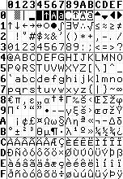
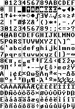
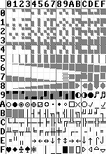
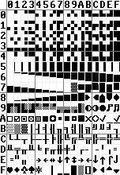

This implements text rendering for the RP2040 `scanvideo` library.
Thanks to hand-optimized assembly code, this is fast enough for 640×480 60 Hz VGA at a modest overclock of 150 MHz.

## Usage

Adjust the settings in `CMakeLists.txt` to match your project's hardware.
Pay particular attention to pin mappings, `TEXT_VIDEO_MODE`, and `SCREEN_` size.
Due to the small size of the demo, `set(PICO_NO_FLASH 1)` is selected, which preloads all code and data into RAM.
In a larger, more functional project, you may need to disable this.
In `main.c`, you can also override the text buffer size and select an alternative font named CP437,
which is the 9×14 font used in the IBM MDA.

The demo is for an LCD I happened to have handy, and includes additional code likely not relevant to your project.
The color values `enum` should be changed to match the color channels you have wired up.
If you enable palette mode, `main_palette` will need to be updated as well.

As of 2024, Adafruit sells a variety of TFT panels of various sizes that should be compatible with `scanvideo`.
Many have a relatively low resolution and could be driven easily without overclocking,
and they don't even require weird voltages.

## Capabilities 

#### Text Buffer

For alignment reasons, this uses 16-bit character codes, which also allows fonts with more than 256 glyphs.
The demo uses this to support displaying both bold and non-bold text on screen at the same time.

16-bit color can be directly encoded in each character cell, making each cell six bytes.
Alternatively, for a modest speed penalty, a palettized color mode can be used,
which decodes 8-bit palette entires into 16-bit colors, for four-byte cells.

At the start of every scan line,
a pointer to the currently active `text_buffer` is cached and used to render the line.
You can switch between different pages of text by simply changing the `text_mode_current_buffer` variable.

#### Font

A fixed-size font of any height and between one and sixteen pixels wide can be used.
Because you can have 16-bit character codes, you can have multiple font sets (e.g. bold and non-bold),
and also have extra dingbats and pseudographical characters.

Note that modern C now supports binary literals directly with the `0b` prefix.
This makes declaring bitmaps a lot easier,
although a GUI font editor is still nice if you write a suitable converter.

Although the provided fonts are declared `const`, your fonts don't need to be.
Using non-`const` fonts would allow you to generate additional glyphs on-demand, allowing for more flexibility.

CJK writing is also readily supported, thanks to support for wider characters and 16-bit character codes.
The assembly code can be readily adapted to characters up to 32 pixels wide if desired.

To save memory, each line of a font can be either one or two bytes.
If you want, you can have a font eight-or-fewer pixels wide with two-byte-size lines.

At the start of every scan line,
a pointer to the currently active `text_mode_font` is cached and used to render the line.
You can switch to a different font by changing the variable.
Note that if you switch to a different font size, the correct size `text_buffer` to use changes,
and there isn't synchronized code to change both the buffer and font at once.

#### Palette

You can enable palettized mode by setting `TEXT_MODE_PALETTIZED_COLOR=1` in `CMakeLists.txt`.
This imposes a performance penalty (i.e. you may need a more aggressive overclock),
but also enables palette changing effects.

At the start of every scan line,
a pointer to the currently active `text_mode_current_palette` is cached and used to render the line.
You can switch to a different palette by changing the variable.

You can also alter the palette by overwriting palette entires directly.
While changing the palette pointer only takes effect at the start of the next line,
changing palette entries will take effect while the line is still being rendered.

#### Performance

Unfortunately, this isn't quite fast enough to achieve 640×480 VGA at 60 Hz with a CPU clock speed of 125 MHz.
However, it works fine with a modest overclock of 150 MHz.

Using hand-optimized assembly, this achieves about 6-8 cycles per output pixel depending on options.
Wider characters reduce overhead and give better performance.
Enabling the palettized mode costs about ½–1 extra cycle per pixel depending on how wide the characters are.

For example, with an 8-pixel-wide font and palettized color turned off,
each pixel will take an average of about 7 cycles.
At 150 MHz, each line will take 1/(150 MHz) × 7 cycles per pixel × 640 pixels = 30 μs.

#### RAM Usage

Your font should be located in RAM, because otherwise cache misses might cause a huge performance penalty.

Since rendering 640×480 is going to eat most of an entire core,
the rendering code assumes it has the entire core to itself.
Rather than being located in main RAM, the rendering code is placed in the scratch Y RAM bank,
which is also where core 1's stack goes.
Placing the rendering code in scratch Y ensures that there can never be contention for an instruction fetch.
Since this eats into the stack space available for core 1,
you might want to be a little more cautious with what other code you run on core 1.

## Demo

The demo implemented is for an 800×480 TFT LCD I got from Adafruit, an AT070TN94.
I wired it up in a six-bits-per-pixel configuration by wiring multiple bits in each channel together.
However, the demo still assumes 16 bits-per-pixel color is used, because that's what `scanvideo` supports.
The panel requires a bunch of unusual voltages to drive the analog pixel matrix,
and `main.c` has logic for initializing the panel.

Obviously, 800×480 is a higher resolution than standard VGA, so you can expect better performance for VGA.
Unlike analog VGA, LCD panels have a dot clock signal to synchronize the input data,
so they can tolerate looser timings, which could allow for less aggressive overclocking.

#### Demo Font

The default font is an 8×12 font that includes:
* Bold and light weights
* Mostly based on the common Windows 1252 codepage
  * Supports most Latin-script European languages
* Additional mathematical characters
* Various cursors
* Box-drawing characters
* Various dingbats that may be useful for GUI elements
  * Radio boxes, check boxes, check marks
  * A lot of variations on arrows
* A set of character codes that are just various square patterns
  * These can be used to produce blocky pixel patterns, like with PETSCII
* Shaded variants of the block graphics provide additional variety
  * For example, they can provide drop shadow effects for GUI elements
* Bar graph elements

The font is a bit squished vertically to maximize how much text can appear on-screen,
but at the cost of reduced legibility.
For higher-resolutions, a more spaced-out 8×16 variant might be preferable,
and if I'm feeling motivated, I might even make it.

#### Font Reference

